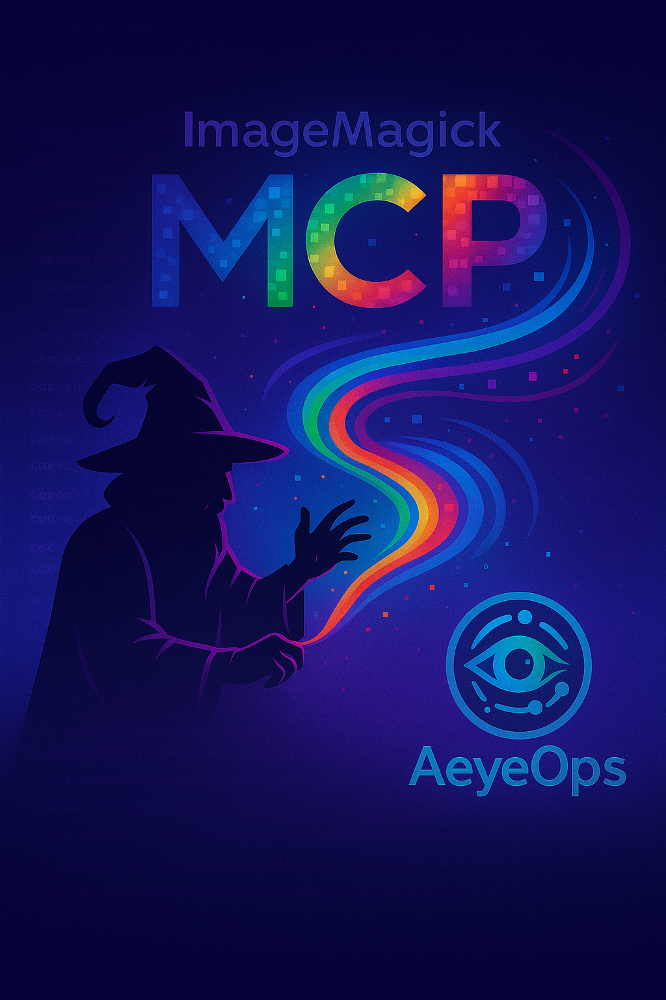

# mcp-imagemagick



An MCP (Model Context Protocol) server for image conversion using ImageMagick and darktable.

## Overview

This server provides tools for converting DNG (Digital Negative) RAW image files to WebP format using either ImageMagick or darktable as the conversion backend. The server implements the MCP protocol over stdio transport, making it compatible with MCP clients like Claude Desktop.

This project serves as both a functional tool and a learning resource for those interested in creating MCP servers. While currently focused on DNG to WebP conversion, we plan to expand its capabilities over time to support more image formats and operations. We're publishing this as a starting point to share our MCP implementation approach and provide others with a working example to learn from.

## Features

- Convert DNG files to WebP format with lossless compression
- Automatic converter selection based on availability
- Fallback support between ImageMagick and darktable
- Full MCP protocol implementation (version 2024-11-05)
- Robust error handling and recovery
- Detailed logging to stderr for debugging

## Prerequisites

You need at least one of the following image converters installed:

### ImageMagick 7
- Command: `convert7` or `magick`
- Install on Ubuntu/Debian: `sudo apt install imagemagick`
- Verify installation: `convert7 -version` or `magick -version`

### darktable-cli
- Command-line interface for darktable RAW processor
- Install on Ubuntu/Debian: `sudo apt install darktable`
- Verify installation: `darktable-cli --version`

## Building from Source

1. Ensure you have Rust installed (https://rustup.rs/)
2. Clone or download this repository
3. Build the project:

```bash
cd mcp-imagemagick
cargo build --release
```

The binary will be available at `target/release/mcp-imagemagick`.

## Usage

### MCP Client Configuration

Add the server to your MCP client configuration. For Claude Desktop, add to your settings:

```json
{
  "mcpServers": {
    "imagemagick": {
      "command": "/path/to/mcp-imagemagick",
      "args": [],
      "env": {}
    }
  }
}
```

### Available Tools

#### convert_dng_to_webp

Converts a DNG file to WebP format with lossless compression.

**Parameters:**
- `input_path` (string, required): Path to the DNG file
- `output_path` (string, required): Path for the WebP output file
- `converter` (string, optional): Which converter to use
  - `"auto"` (default): Automatically select the best available converter
  - `"imagemagick"`: Use ImageMagick (requires `convert7` or `magick`)
  - `"darktable"`: Use darktable-cli

**Example usage:**
```json
{
  "tool": "convert_dng_to_webp",
  "arguments": {
    "input_path": "/path/to/photo.DNG",
    "output_path": "/path/to/output.webp",
    "converter": "auto"
  }
}
```

#### check_converters

Check which image converters are available on the system.

**Parameters:** None required

**Returns:** List of available converters and their status

## Technical Details

### Converter Priority

When using `"auto"` converter selection:
1. **ImageMagick** (priority: 60) - Attempted first when available
2. **darktable** (priority: 40) - Used as fallback or when specifically requested

Note: ImageMagick may not support DNG files directly on all systems. The auto-converter will automatically fall back to darktable if ImageMagick fails.

### Conversion Settings

#### ImageMagick WebP settings:
- `webp:lossless=true` - Lossless compression
- `webp:exact=true` - Preserve exact pixel values
- `webp:method=6` - Maximum compression effort
- `webp:partition-limit=0` - No partition limit

#### darktable-cli:
- Uses darktable's RAW processing pipeline
- Automatically applies any XMP sidecar files if present
- Provides accurate color management for RAW files

## Error Handling

The server includes comprehensive error handling:
- Continues running even if individual conversions fail
- Returns proper JSON-RPC error responses
- Logs detailed error information to stderr
- Automatically falls back to alternative converters when available

## Logging

Control logging verbosity with the `RUST_LOG` environment variable:

```bash
# Show only errors
RUST_LOG=error mcp-imagemagick

# Show informational messages
RUST_LOG=info mcp-imagemagick

# Show detailed debug information
RUST_LOG=debug mcp-imagemagick
```

## Testing

Run the integration test:

```bash
cd mcp-imagemagick
python3 test_mcp.py
```

## Project Structure

```
mcp-imagemagick/
├── src/
│   ├── main.rs           # Entry point with panic handler
│   ├── server.rs         # MCP server implementation
│   ├── transport.rs      # Synchronous stdio transport
│   ├── handlers/         # Request handlers
│   │   └── image.rs      # Image conversion tools
│   └── converters/       # Converter implementations
│       ├── mod.rs        # Auto-converter with fallback
│       ├── imagemagick.rs # ImageMagick converter
│       └── darktable.rs  # darktable converter
├── docs/                 # Additional documentation
└── test_mcp.py          # Integration test

## License

MIT License - see LICENSE file for details.

## Security Considerations

This project inherits security considerations from ImageMagick. Please be aware:

- **ImageMagick processes many file formats**, some of which can contain malicious payloads
- **Always process images from trusted sources** when possible
- **Check your ImageMagick security policy** (`policy.xml`) is properly configured
- **Consider running with limited permissions** in production environments

For detailed security information, see [SECURITY.md](SECURITY.md) and [ImageMagick's Security Policy](https://imagemagick.org/script/security-policy.php).

## Third-Party Software

This project uses the following third-party software:

### ImageMagick
- Copyright © 1999 ImageMagick Studio LLC
- Licensed under the ImageMagick License
- License: https://imagemagick.org/script/license.php
- Used for image conversion operations

### darktable
- Copyright © darktable developers
- Licensed under GPL 3.0 or later
- License: https://github.com/darktable-org/darktable/blob/master/LICENSE
- Used for RAW image processing

Note: This project calls these tools via their command-line interfaces and does not distribute or incorporate their source code.